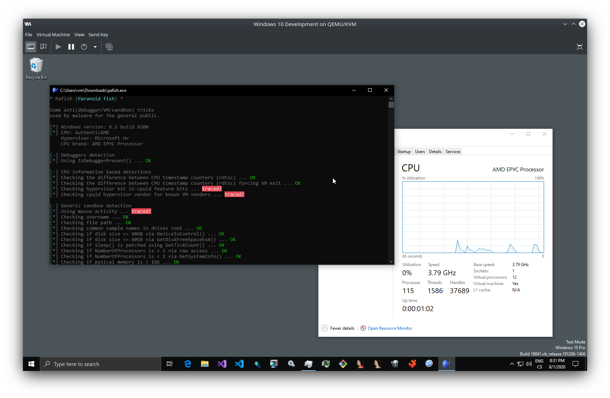

# BetterTiming
This is a small project of mine aiming to improve CPU timing in KVM SVM implementation to bypass certain anti-VM checks. It registers VM-exit for RDTSC instruction and then tries to offset it by the time spend in specified VM-exits.



**Disclaimer:** Testing was done only in an isolated environment. Doing such a change might introduce unwanted side effects to the guest OS.

## How to apply the patch
You will need to recompile Linux kernel from source. If you are on a distribution that has a custom build system, it might be easier to use it for building the kernel. The patch is currently for version 5.7.11, but you should be able to easily modify it for any new version of the kernel. 

1.) Download and extract kernel source
```
wget https://cdn.kernel.org/pub/linux/kernel/v5.x/linux-5.7.11.tar.gz
tar -xf linux-5.7.11.tar.gz
cd linux-5.7.11
```
2.) Download the patch
```
git clone https://github.com/SamuelTulach/BetterTiming
mv BetterTiming/rdtsc_timing.patch rdtsc_timing.patch
```
3.) Apply patch
```
patch -s -p0 < rdtsc_timing.patch
```
4.) Build and install the kernel

## How it works
The concept of this is extremely simple. I have added additional variables to `kvm_vcpu` struct.
```
u64 last_exit_start;
u64 total_exit_time;
```
Then created a wrapper function around `vcpu_enter_guest` (which is where VM-exit is handled). This wrapper would then save the time it took for the vcpu to exit if the exit reason matches specified value.
```
static int vcpu_enter_guest(struct kvm_vcpu *vcpu) 
{	
	int result;
	u64 differece;
	
	vcpu->last_exit_start = rdtsc();

	result = vcpu_enter_guest_real(vcpu);

	if (vcpu->run->exit_reason == 123) 
	{
		differece = rdtsc() - vcpu->last_exit_start;
		vcpu->total_exit_time += differece;
	}

	return result;
}
```
Added a VM-exit handler for RDTSC instruction which takes those values.
```
static int handle_rdtsc_interception(struct vcpu_svm *svm) 
{
	u64 differece;
	u64 final_time;
	u64 data;
	
	differece = rdtsc() - svm->vcpu.last_exit_start;
	final_time = svm->vcpu.total_exit_time + differece;

	data = rdtsc() - final_time;

	svm->vcpu.run->exit_reason = 123;
	svm->vcpu.arch.regs[VCPU_REGS_RAX] = data & -1u;
	svm->vcpu.arch.regs[VCPU_REGS_RDX] = (data >> 32) & -1u;

	skip_emulated_instruction(&svm->vcpu);

	return 1;
}
```

## Troubleshooting
- **Q:** VM does not seem to boot after the patch!
- **A:** Double check if the patch was applied correctly and that your CPU supports RDTSC instruction.
- **Q:** I am still getting detected by some rootkits!
- **A:** Check that you have CPU pinning enabled and that you have free cores that are not pinned to the VM. In case CPU pinning is already in place, you can try increasing the difference in `vcpu_enter_guest`. Also you might want to specify exit reason for other instructions then just CPUID.
- **Q:** My PC does not boot after applying the patch!
- **A:** The patch does not change anything unless you boot a VM. Please check that you have compiled the kernel with correct settings.
- **Q:** I installed the new kernel, but I can see only blinking cursor!
- **A:** If you have NVIDIA GPU, make sure that the driver did not fuck itself after installation of a custom kernel. If you are on Arch Linux for example, you can use package `nvidia-dkms` to install the proprietary driver.
